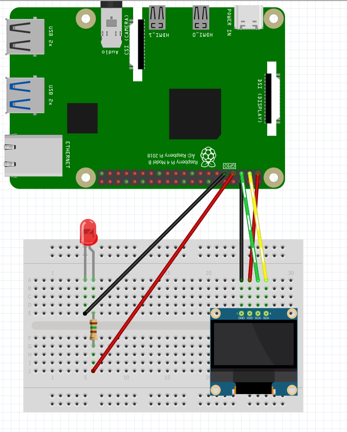

# Morse-Blinker

In this project I used a LED to blink messages in MORSE code.

## Demo

https://user-images.githubusercontent.com/62222747/145721261-b73d4130-104f-4bdc-9a2d-574a74b23187.mp4

The things you can do on this project are:

-   Send a message from the 'Morse' app to the raspberry and have it blink it letter by letter.
-   View the letter that is currently blinked on the small screen.

_I used MQTT protocol to send data from the android application to the raspberry board._

## Schematics

---

## Pre-requisites

-   RaspberryPi 4 board
-   Android Studio 2.2+
-   MQTT cloud broker (I used HiveMQ)
-   Individual components:
    -   1 LED
    -   1 OLED display (I2C version)
    -   1 resistor
    -   jumper wires
    -   1 breadboard

## Running

1. Launch app in Android Studio.
2. Run application on raspberry.
3. Write a message and click 'MORSE' to send it to the raspberry board.
4. Watch the LED blink accordingly.
